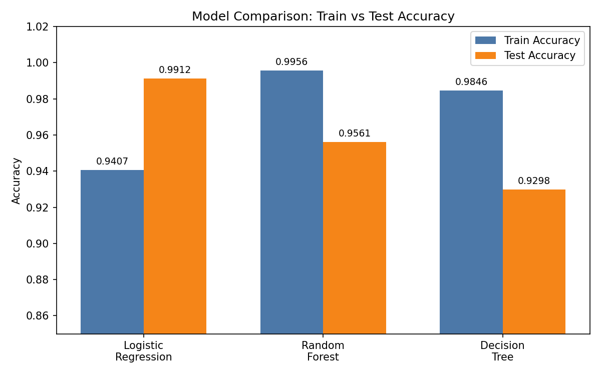

# Breast Cancer Prediction Project

Predicts whether a breast tumour is malignant or benign using machine learning.

## Dataset
- `breast_cancer.csv` — 569 rows, 30 tumour measurements + target column
- Target: 0 = malignant, 1 = benign

## Steps
1. Loaded the dataset and inspected it
2. Data cleaning — checked duplicates and missing values
3. Data preparation — split into features (X) and target (y)
4. EDA — target distribution, feature histograms, correlation heatmap
5. Feature selection — kept the top 10 most correlated features
6. Model building — Logistic Regression, Random Forest, Decision Tree algorithm used for finding the best model.
7. Final pipeline — StandardScaler + Logistic Regression, tuned with GridSearchCV (Best C = 10, test accuracy 0.9825), saved as `breast_cancer_model.pkl`
8. Streamlit web app (`app.py`) for live predictions

## Model Results

Final tuned model test accuracy: **0.9825**

## How to Run
1. Install packages: `pip install -r requirements.txt`
2. Open `breast_cancer.ipynb` and run all cells
3. Creat new Terminal
4. Start the app: `streamlit run app.py`

## Adding to GitHub
git init
git add .
git commit -m "Breast cancer prediction project"
git branch -M main
git remote add origin https://github.com/harekrishna10/breast-cancer-prediction.git
git push -u origin main
